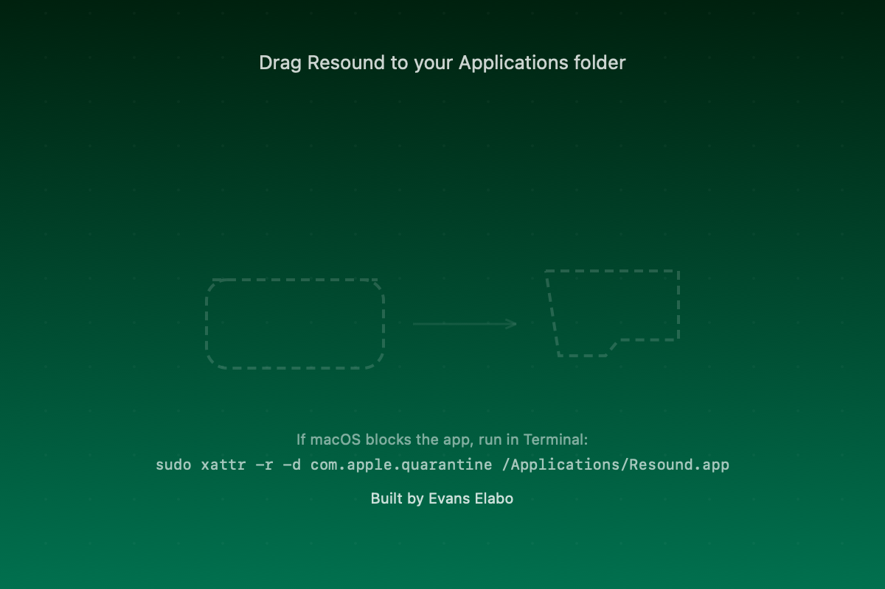

# Resound

A macOS menubar app that adds a Dynamic Island-style music controller to your Mac's notch. Sits as a compact pill at the top of the screen showing now-playing info from Spotify or Apple Music — expands on hover with full controls.



## Features

- **Dynamic Island pill** — compact (38pt) and expanded (192pt) states with smooth animation
- **Now playing** — track info, album art, progress bar with elapsed/remaining time
- **Playback controls** — play/pause, skip, previous
- **Waveform visualization** — customizable style and colors
- **Global hotkeys** — play/pause, next, previous, toggle island
- **Customizable position** — left, center, or right of the notch
- **Menu bar icon** — quick access to track info and settings
- **No dock icon** — runs quietly in the background

## Requirements

- macOS 14.0 (Sonoma) or later
- A Mac with a notch (or without — the pill works anywhere)
- Spotify or Apple Music

## Installation

### Download

Download the latest `Resound.dmg` from the [Releases page](https://github.com/ellaboevans/resound-dynamic-island/releases).

1. Open the DMG
2. Drag **Resound.app** into **Applications**
3. If macOS warns about an unidentified developer, run this in Terminal:

   ```
   sudo xattr -r -d com.apple.quarantine /Applications/Resound.app
   ```

4. Open Resound from Applications

### Build from source

```bash
git clone https://github.com/ellaboevans/resound-dynamic-island.git
cd resound-dynamic-island
make release
make dmg
```

Requires Swift 5.9+ and [create-dmg](https://github.com/create-dmg/create-dmg) (`brew install create-dmg`) for DMG building.

## Usage

Launch Resound — it appears in your menubar. The pill shows at the top of your screen when music is playing. Hover to expand. Use the menubar icon for settings and playback controls.

Configure hotkeys, position, and appearance in **Settings** (accessible from the menubar icon).

## Credits

Built by Evans Elabo
